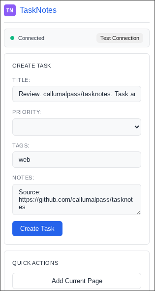

# TaskNotes Browser Extension



A browser extension that integrates TaskNotes with Gmail and other web pages, allowing you to create tasks directly from your browser.

## Features

- **Gmail Integration**: Add TaskNotes button directly to Gmail interface
- **One-Click Task Creation**: Create tasks from emails with extracted metadata
- **Right-Click Context Menu**: Add tasks from any webpage, selected text, or links
- **Popup Interface**: Full-featured task creation and settings management
- **Connection Status**: Real-time API connection monitoring
- **Customizable Settings**: Configure API port, authentication, default tags

## Prerequisites

1. **TaskNotes Plugin**: Install and configure the TaskNotes plugin for Obsidian
2. **HTTP API Enabled**: Enable the HTTP API in TaskNotes Settings → HTTP API tab
3. **Desktop Only**: The TaskNotes API only works on desktop platforms

## Installation

### From Chrome Web Store (Recommended)

*Coming soon - extension will be published to Chrome Web Store*

### Manual Installation (Developer Mode)

1. **Download**: Clone or download this repository
2. **Build**: Run `npm install && npm run build` (optional - pre-built files included)
3. **Install**:
   - Open Chrome and go to `chrome://extensions/`
   - Enable "Developer mode" (toggle in top right)
   - Click "Load unpacked"
   - Select the `tasknotes-browser-extension` folder
4. **Configure**: Click the extension icon and configure your API settings

## Setup

1. **Enable TaskNotes API**:
   - Open Obsidian with TaskNotes plugin installed
   - Go to Settings → TaskNotes → HTTP API tab
   - Enable "Enable HTTP API"
   - Note the port number (default: 8080)
   - Optionally set an authentication token
   - Restart Obsidian

2. **Configure Extension**:
   - Click the TaskNotes extension icon in Chrome
   - Enter your API port (should match TaskNotes settings)
   - Enter authentication token if you set one
   - Set default tags and priority
   - Click "Test Connection" to verify setup

## Usage

### Gmail Integration

1. **Open Gmail** in your browser
2. **Open any email**
3. **Look for TaskNotes button** in the toolbar
4. **Click the button** to create a task with email metadata
5. **Task includes**: Subject, sender, email URL, and preview

### Context Menu

1. **Right-click** on any webpage
2. **Select "Add to TaskNotes"** from context menu
3. **Options available**:
   - Add current page
   - Add selected text
   - Add clicked link
   - Add email (on Gmail)

### Extension Popup

1. **Click extension icon** in Chrome toolbar
2. **Create custom tasks** with title, priority, notes
3. **Quick actions**: Add current page, view stats
4. **Configure settings**: API port, auth token, defaults
5. **Monitor connection** status

## API Integration

The extension communicates with your local TaskNotes API:

- **Base URL**: `http://localhost:{PORT}/api`
- **Authentication**: Optional Bearer token
- **Endpoints Used**:
  - `GET /api/health` - Connection testing
  - `POST /api/tasks` - Task creation  
  - `GET /api/stats` - Statistics display

## Troubleshooting

### Extension Not Working

1. **Check TaskNotes API**:
   - Ensure Obsidian is running
   - Verify API is enabled in TaskNotes settings
   - Test with `curl http://localhost:8080/api/health`

2. **Check Extension Settings**:
   - Verify correct port number
   - Check authentication token if using one
   - Test connection in extension popup

3. **Browser Issues**:
   - Refresh Gmail page
   - Disable other extensions temporarily
   - Check browser console for errors

### Gmail Button Not Appearing

1. **Refresh Gmail** page
2. **Check URL**: Must be `https://mail.google.com/*`
3. **Wait for load**: Gmail takes time to fully load
4. **Check console**: Look for JavaScript errors

### Connection Errors

- **"Connection refused"**: TaskNotes API not running or wrong port
- **"Unauthorized"**: Check authentication token
- **"CORS error"**: API should automatically allow cross-origin requests

## Development

### Project Structure

```
tasknotes-browser-extension/
├── manifest.json           # Extension manifest
├── src/
│   ├── api-client.js      # TaskNotes API client
│   └── background.js      # Background service worker
├── popup/
│   ├── popup.html         # Extension popup interface
│   ├── popup.css          # Popup styles
│   └── popup.js           # Popup logic
├── content-scripts/
│   ├── gmail.js           # Gmail integration
│   └── outlook.js         # Outlook integration (future)
└── styles/
    ├── gmail.css          # Gmail-specific styles
    └── outlook.css        # Outlook-specific styles (future)
```


### Adding New Email Providers

To add support for new email providers:

1. Create content script in `content-scripts/`
2. Add CSS styles in `styles/`
3. Update `manifest.json` with new URL patterns
4. Add provider-specific extraction logic


## Related Projects

- **[TaskNotes Plugin](https://github.com/callumalpass/tasknotes)**: Main Obsidian plugin
- **[TaskNotes Documentation](https://callumalpass.github.io/tasknotes/)**: Full documentation

## License

This project is licensed under the MIT License.

